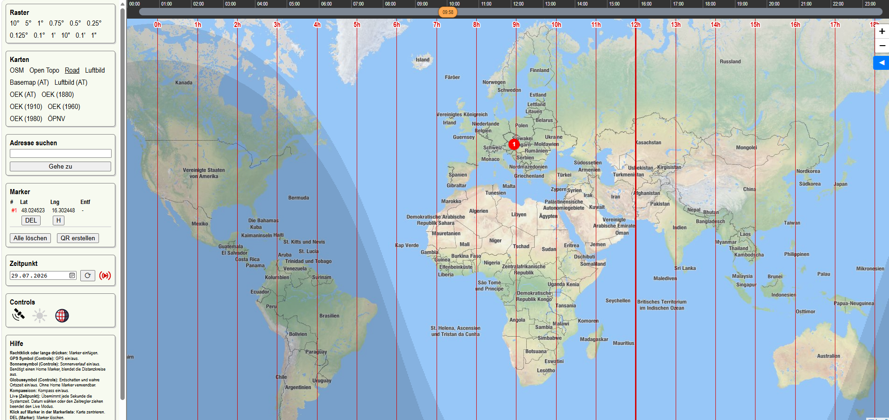

# Kartenblick

Eine Karte im Browser, die mehr kann als nur Kacheln zeigen: Koordinatengitter bis zur Bogensekunde,
Entfernungskreise um einen selbst gesetzten Mittelpunkt, den Sonnenverlauf für diesen Punkt sowie
Erdschatten und wahre Ortszeit für die ganze Welt.

**➜ [Kartenblick öffnen](https://schletz.github.io/gridmap/)**

Die gesamte Anwendung ist eine einzige HTML-Datei. Es gibt keinen Server, kein Konto und keine
Registrierung – alles läuft im Browser, gesetzte Marker bleiben nur lokal auf dem Gerät.



## Funktionen im Überblick

### Karten

Zwölf Kartenquellen stehen im Menüblock **Karten** zur Wahl, ein Klick wechselt sofort:

| Eintrag | Inhalt |
| --- | --- |
| OSM, Open Topo, Road | Standard-, Topografie- und Straßenkarte |
| Luftbild | Satellitenbild, weltweit bis Zoomstufe 20 |
| Basemap (AT), Luftbild (AT) | amtliche österreichische Karte und Orthofoto |
| OEK (AT) | aktuelle Österreichische Karte des BEV |
| OEK (1880) … OEK (1980) | historische Ausgaben der Österreichischen Karte |
| ÖPNV | Karte mit Linien des öffentlichen Verkehrs |

Die historischen Karten eignen sich gut für Vergleiche: dieselbe Position, ein Jahrhundert
Unterschied – einfach zwischen den Einträgen hin- und herschalten.

### Koordinatengitter

Der Block **Raster** legt ein Gitter aus Meridianen und Breitenkreisen über die Karte, wählbar von
10° bis hinunter zu 1". Die Linien sind beschriftet, führende Nullanteile werden weggelassen
("13°E" statt "13°0'0"E").

> **Hinweis:** Ein sehr feines Raster bei kleinem Zoom erzeugt sehr viele Linien und macht den
> Browser langsam. Feine Abstufungen erst wählen, wenn weit genug hineingezoomt ist.

### Marker und Entfernungskreise

**Rechtsklick** auf die Karte (am Handy: langes Drücken) setzt einen Marker. Alle Marker erscheinen
in der Tabelle im Menü mit Koordinaten und Entfernung; ein Klick auf eine Zeile zentriert die Karte
darauf.

Jede Zeile hat zwei Knöpfe:

- **H** – macht den Marker zum *Home*-Marker. Um ihn werden konzentrische Entfernungskreise
  gezeichnet, deren Abstand automatisch zum Zoom passt (100 m bis 1000 km, jeder fünfte Kreis
  kräftiger). Zusätzlich zieht die Karte Verbindungslinien vom Home-Marker zu allen anderen
  Markern, und die Spalte **Entf** zeigt deren Abstand. Ein erneuter Klick auf **H** hebt das
  Home wieder auf.
- **DEL** – löscht den Marker. **Alle löschen** räumt die ganze Liste.

Die Marker bleiben im Browser gespeichert und sind nach einem Neustart wieder da.

### Adresssuche

Ein Ort oder eine Adresse im Feld **Adresse suchen** springt zum ersten Treffer (über Nominatim von
OpenStreetMap) und setzt dort gleich einen Marker. Findet die Suche nichts, steht die Meldung im
Suchfeld selbst.

### Teilen per QR-Code

**QR erstellen** erzeugt einen QR-Code, der den kompletten Markersatz enthält. Am Handy abscannen –
und dieselben Punkte stehen dort auf der Karte. Ein Klick auf den QR-Code kopiert stattdessen den
Link in die Zwischenablage. Der geöffnete Link **ersetzt** die vorhandenen Marker des Zielgeräts.

### Standort und Kompass

Das Satellitensymbol unter **Controls** schaltet die GPS-Ortung ein. Die Karte springt einmalig zur
eigenen Position, danach folgt ein Pfeilmarker der Bewegung. Liefert das Gerät einen Kompass, dreht
sich der Pfeil in Blickrichtung. Solange die Karte von Hand verschoben wird, springt die Ansicht
nicht zurück. Der Knopf **ADD** in der Standortzeile übernimmt die aktuelle Position als
gewöhnlichen Marker.

### Sonnenverlauf ☀

Das Sonnensymbol unter **Controls** blendet einen Peilkreis über die Karte, der den Himmel über dem
Home-Marker abbildet: der Horizont liegt auf dem Kreisrand, der Zenit im Mittelpunkt. Zu sehen sind

- der **Tagesbogen** des gewählten Datums,
- das **Jahresband** – die Fläche, die die Sonne im Lauf des Jahres zwischen Winter- und
  Sommersonnenwende überstreicht,
- die aktuelle Sonnenposition zum gewählten Zeitpunkt.

Damit lässt sich ablesen, wo die Sonne an einem Ort auf- und untergeht und wie hoch sie mittags
steht – etwa für die Planung von Photovoltaik, Balkon oder Fotostandort.

Daneben erscheint die Tabelle **Solardaten** mit Morgendämmerung, Sonnenaufgang, Höchststand samt
Höhenwinkel, Sonnenuntergang, Abenddämmerung und Tageslänge. In Polnähe steht dort statt einer
Uhrzeit ein Hinweis wie "Die Sonne geht an diesem Tag nicht unter."

Das Feature braucht einen **Home-Marker**; ohne ihn bleibt der Knopf inaktiv. Solange der
Sonnenverlauf läuft, sind die Entfernungskreise ausgeblendet, damit sie den Peilkreis nicht
verdecken.

### Weltzeit 🌍

Das Globussymbol zeigt zwei Dinge gleichzeitig – ohne dass ein Marker nötig wäre:

- den **Erdschatten**: die Nachthälfte der Erde, mit der Dämmerungszone als hellerer Stufe,
- das **Ortszeit-Gitter**: rote Meridiane im Abstand von 15°, beschriftet mit der *wahren Ortszeit*.
  Die dicke Linie ist der Sonnenmeridian, dort ist es echte 12 Uhr Mittag. Weil das die wahre
  Sonnenzeit ist, weicht sie je nach Jahreszeit um bis zu einer Viertelstunde von der Zonenzeit ab.

Genau diese Ansicht zeigt der Screenshot oben.

### Zeitpunkt und Zeitleiste

Sobald Sonnenverlauf oder Weltzeit aktiv sind, erscheinen der Menüblock **Zeitpunkt** und über der
Karte eine Zeitleiste:

- Die **Zeitleiste** deckt den gewählten Tag von Mitternacht bis Mitternacht ab. Ihre Einfärbung
  zeigt Nacht (dunkelblau), Dämmerung (hellblau) und Tag (gelb) für den Home-Marker; ohne Home-Marker
  bleibt sie grau. Den Regler ziehen bewegt Sonnenstand, Erdschatten und Ortszeit-Gitter mit.
- Das **Datumsfeld** wechselt den Tag.
- **⟳** springt zurück auf den aktuellen Zeitpunkt.
- **Live** lässt die Darstellung sekündlich der Systemuhr folgen. Sobald das Datum geändert oder der
  Regler gezogen wird, endet der Live-Modus wieder.

Alle Uhrzeiten sind in der Zeitzone des eigenen Geräts angegeben, auch wenn der Home-Marker auf
einem anderen Kontinent liegt.

### Menü ein- und ausblenden

Der Pfeilknopf **◄** am linken Kartenrand klappt das Seitenmenü weg – nützlich auf kleinen
Bildschirmen oder wenn die Karte allein zählt.

## Bedienung auf einen Blick

| Aktion | Wirkung |
| --- | --- |
| Rechtsklick / langes Drücken | Marker setzen |
| Klick auf eine Markerzeile | Karte auf den Marker zentrieren |
| **H** | Marker als Mittelpunkt der Entfernungskreise setzen bzw. aufheben |
| **DEL** / **Alle löschen** | einzelnen Marker bzw. alle löschen |
| **ADD** | aktuellen GPS-Standort als Marker übernehmen |
| **QR erstellen** | Markersatz als QR-Code, Klick darauf kopiert den Link |
| Satellitensymbol | GPS-Ortung ein/aus |
| Sonnensymbol | Sonnenverlauf ein/aus (braucht Home-Marker) |
| Globussymbol | Erdschatten und Ortszeit ein/aus |
| **◄** | Seitenmenü ein/aus |

## Datenschutz

Es gibt keinen eigenen Server. Marker liegen ausschließlich im lokalen Speicher des Browsers und
verlassen das Gerät nur, wenn ein QR-Code oder Link bewusst weitergegeben wird. Kartenkacheln werden
direkt von den jeweiligen Anbietern geladen, Adresssuchen gehen an Nominatim; GPS-Position und
Kompassdaten bleiben im Browser.

## Lokal starten

Die ausgelieferte Anwendung ist die Datei `index.html` im Projektverzeichnis – sie lässt sich direkt
im Browser öffnen. Für die Entwicklung:

```bash
npm install
npm run dev     # Entwicklungsserver
npm run build   # baut index.html neu
```

Gebaut wird mit [Vite](https://vite.dev/) und TypeScript, die Karte selbst basiert auf
[Leaflet](https://leafletjs.com/), die Sonnenberechnung auf
[SunCalc](https://github.com/mourner/suncalc). Technische Details stehen in
[architecture.md](architecture.md).

---

Implementiert mit [Claude Code](https://claude.com/claude-code).
